# Giới thiệu và So sánh các Giao thức APB, AHB, và AXI

APB, AHB, và AXI là các giao thức bên trong chip (on-chip protocol) thuộc họ AMBA,
được tạo ra bởi ARM nhằm để kết nối các IP trong cùng một con chip lại với nhau.
Ba giao thức này khác nhau ở độ phức tạp, thông lượng (throughput), và loại duplex (half-duplex hay full-duplex),
với APB là giao thức đơn giản nhất, và AXI là phức tạp nhất.
Trong bài này, chúng ta sẽ tìm hiểu về cách trao đổi thông tin cơ bản nhất trong mỗi giao thức.
Đồng thời, bài này cũng cung cấp thiết kế sơ lược của một slave register module của ba giao thức này.

> Khác với các giao thức ngoại vi (peripheral protocol) như I2C, SPI, hay UART,
> các giao thức trong chip (on-chip protocol) không được sử dụng để giao tiếp với chip khác.
> Do đó, các giao thức này thường có nhiều đường tín hiệu hơn và hoạt động ở tần số cao hơn.

## APB (Advanced Peripheral Bus)
APB là loại giao thức đơn giản nhất trong AMBA, được dùng để kết nối các ngoại vi có tần số thấp
như GPIO, Timer, I2C, SPI, UART. Các tín hiệu trong APB có thể được phân loại thành:
- Tín hiệu hệ thống (system): `PCLK` (clock) và `PRESETn` (reset, active low);
- Tín hiệu điều khiển (control): `PSEL` (select), `PENABLE` (enable), `PADDR` (address), `PWRITE` (write/read);
- Tín hiệu dữ liệu (data): `PWDATA` (write data), `PRDATA` (read data);
- Tín hiệu phản hồi (response): `PREADY` (ready), `PSLVERR` (slave error).

Chúng ta sẽ bỏ qua các chi tiết của `PCLK`, `PRESETn`, `PADDR`, `PWDATA`, `PRDATA` vì chức năng của chúng cũng khá là rõ ràng rồi.
Nếu chúng ta muốn ghi (write) vào slave, ta sẽ set `PWRITE = 1`. Nếu chúng ta muốn đọc (read) thì `PWRITE = 0`.
Nếu slave muốn phản hồi một lỗi (error) thì nó sẽ trả về `PSLVERR = 1`. Nếu `PSLVERR = 0` thì tức là quá trình truyền thành công, không có lỗi.

Điểm quan trọng trong APB chính là tương tác giữa 3 tín hiệu `PSEL`, `PENABLE`, và `PREADY`.
Một transfer trong APB luôn phải trải qua 2 phase:
- Setup phase: `PSEL = 1`, `PENABLE = 0`, và bỏ qua `PREADY`.
Trong phase này, master sẽ set các tín hiệu điều khiển và `PWDATA`.
Các slave đơn giản không cần phải quan tâm phase này.
- Access phase: `PSEL = 1`, `PENABLE = 1`, và `PREADY = 0`
cho đến khi slave muốn kết thúc transfer thì slave sẽ set `PREADY = 1`.
Trong phase này, slave sẽ thực hiện công việc ghi và đọc.
Nếu loại giao dịch là đọc `PWRITE = 0`, thì giá trị của `PRDATA` và `PSLVERR` chỉ có hiệu lực khi `PREADY = 1`.

Sau đây là timing diagram (waveform) của một số dạng transfer:

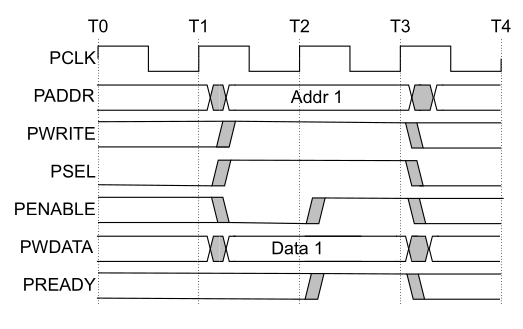

Hình trên là một transfer ghi không chờ (write transfer with no wait states).
Chúng ta có thể thấy transfer này có 2 phase rõ ràng: setup phase từ T1 đến T2 (`PSEL = 1`, `PENABLE = 0`), và access phase từ T2 đến T3 (`PSEL = 1`, `PENABLE = 1`).
Do là một transfer ghi, ta có `PWRITE = 1`. Đồng thời địa chỉ `PADDR` và dữ liệu ghi `PWDATA` cũng được cung cấp trong setup phase.
Do transfer này không chờ, access phase được kết thúc ngay lập tức với `PREADY = 1`.
Transfer kết thúc tại T3 (vì `PREADY = 1` trong access phase), và master có thể bắt đầu truyền dữ liệu mới.

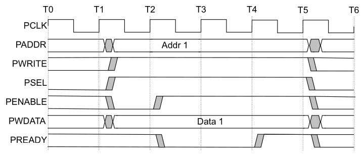

Hình này cũng là một transfer ghi nhưng có chờ (write transfer with wait states).
Setup phase vẫn từ T1 đến T2, nhưng access phase không kết thúc ngay, mà được kéo dài từ T2 đến T5.
Để báo với master là slave cần phải chờ thêm 2 clock, slave set `PREADY = 0` từ T2 đến T4.
Đến T5, slave muốn kết thúc transfer và set `PREADY = 1`. Sau T5, master có thể bắt đầu truyền dữ liệu khác.

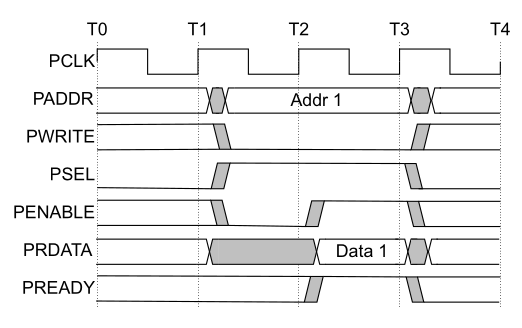
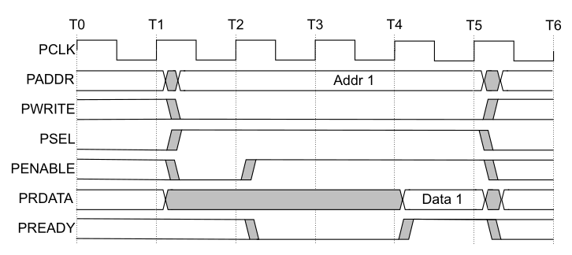

Đây là biểu đồ cho transfer đọc không chờ (hình trên) và có chờ (hình dưới).
`PSEL`, `PENABLE`, và `PREADY` cũng tương tự như trường hợp ghi, nhưng
do là transfer đọc, ta có `PWRITE = 0`. Lưu ý rằng dữ liệu đọc `PRDATA` chỉ có hiệu lực khi `PREADY = 1`.

APB là một giao thức đơn giản và các thiết kế sử dụng APB thường không cần đến flip-flop để lưu các giá trị trung gian.
Để thiết kế một module register với giao tiếp APB slave, ta có thể sử dụng `PSEL & PENABLE` để chỉ ra rằng slave đang trong access phase.
Sau đó kết hợp với `PWRITE` để kích hoạt cổng ghi hoặc đọc của thanh ghi.
Đây là sơ đồ khối của thiết kế này:

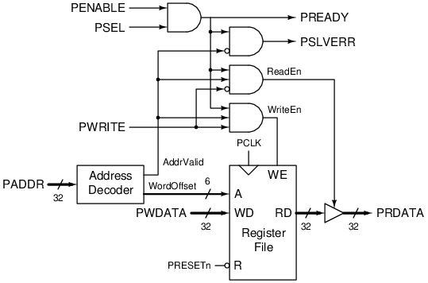

`PREADY` luôn trả về 1 trong access phase (`PSEL & PENABLE`) vì module này không cần chờ.
Lưu ý rằng phần mạch liên quan tới giao tiếp APB là tổ hợp và không cần flip-flop (trừ register file vì đó là chức năng của module).

## AHB (Advanced High-performance Bus)
AHB là giao thức có độ phức tạp giữa APB và AXI, thường được dùng để kết nối các module trong các MCU nhỏ như Flash, RAM, và DMA.
Nhược điểm của APB là mỗi transfer phải được thực hiện trong ít nhất 2 clock, tức là thông lượng (throughput) tối đa của APB chỉ là 0.5 transfer/clock.
AHB giải quyết vấn đề này bằng cách sử dụng kỹ thuật pipeline. Cụ thể, một transfer trong AHB cũng trải qua 2 phase:
- Address phase: các tín hiệu điều khiển (control) như `HSEL`, `HTRANS`, `HADDR`, `HWRITE` sẽ được truyền trong phase này.
- Data phase: các tín hiệu dữ liệu (data) như `HWDATA`, `HRDATA`, và các tín hiệu phản hồi (response) `HREADY`, `HRESP` sẽ được truyền trong phase này.

> `HTRANS` là phiên bản nâng cấp 2 bit của `PENABLE`. Nếu master muốn truyền dữ liệu,
> master sẽ set `HTRANS = 10 (NONSEQ)`. Nếu master không có dữ liệu gì để truyền, nó sẽ set `HTRANS = 00 (IDLE)`
> và slave sẽ bỏ qua mọi tín hiệu trên bus.
> Ngoài ra, AHB còn hỗ trợ burst mode (truyền nhiều transfer có địa chỉ kề nhau) với `HTRANS = 11 (SEQ)`.

> `HRESP` là tên gọi khác của `PSLVERR`, bằng 1 khi slave muốn thông báo một lỗi, bằng 0 khi không có lỗi.

Điều khác biệt là các phase này không xảy ra tuần tự như trong APB, mà sẽ được xếp chồng.
Tức là khi transfer 1 trong data phase thì tại cùng thời điểm đó transfer 2 sẽ trong address phase.
Khi transfer 2 trong data phase thì transfer 3 sẽ trong address phase (transfer 1 đã kết thúc).
Mỗi phase sẽ kết thúc và chuyển qua phase tiếp theo mỗi khi `HREADY = 1`.

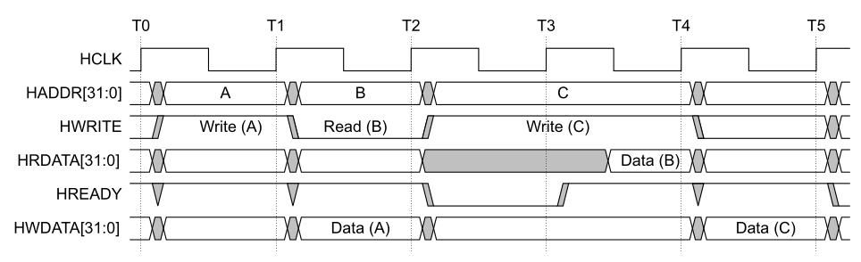

Trong hình trên có 3 transfer `Write A`, `Read B`, `Write C`.
Ta có thể chia biểu đồ trên thành các giai đoạn:
- Từ T0 đến T1: address phase của `A` với `HSEL = 1`, `HTRANS = 10`, `HWRITE = 1`, và `HADDR` chỉ vào địa chỉ của A.
Giai đoạn này kết thúc với `HREADY = 1` ở T1.
- Từ T1 đến T2: data phase của `A` với `HWDATA` hợp lệ. Đồng thời, address phase của `B` cũng xảy ra.
Giai đoạn này kết thúc với `HREADY = 1` ở T2.
- Từ T2 đến T4: data phase của `B` và address phase của `C`. Tuy nhiên, data phase `B` cần thêm 1 clock để đọc dữ liệu,
cho nên slave sẽ set `HREADY = 0` từ T2 đến T3 để báo với master là chưa thể qua phase tiếp theo tại T3.
Đến T4, slave đã sẵn sàng nên set `HREADY = 1` cùng với `HRDATA` hợp lệ.
Lưu ý rằng master vẫn phải duy trì address phase của `C` cho đến khi slave set `HREADY = 1`.
- Từ T4 đến T5: data phase của `C` và address phase của transfer tiếp theo nếu có.
Nếu master không còn transfer nào khác, master sẽ set `HTRANS = 00`.

Bằng việc sử dụng kỹ thuật pipeline, trong điều kiện lý tưởng, AHB có thể truyền 1 transfer/clock (mặc dù độ trễ (latency) vẫn là 2 clock),
tức là thông lượng sẽ gấp đôi APB với cùng tần số. Tuy nhiên, AHB đánh đổi tốc độ với độ phức tạp trong thiết kế.
Cụ thể, để thiết kế một module sử dụng giao tiếp AHB, điều kiện cần là phải có một thanh ghi để nhớ được các tín hiệu điều khiển từ address phase,
sau đó sử dụng nó trong data phase. Sau đây là một thiết kế của một module register sử dụng AHB (với một số tính năng khác như `HSIZE` và `HWSTRB`):

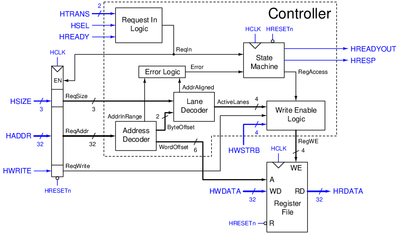

Ở bên trái là một thanh ghi để lưu lại các giá trị của `HSIZE`, `HADDR`, và `HWRITE` trong address phase để sử dụng lại trong data phase.
Thời điểm chuyển phase được quyết định bởi `HTRANS`, `HSEL`, và `HREADY` với logic nằm trong khối `Request In Logic`.
Để hỗ trợ thêm tín hiệu lỗi `HRESP` thì thiết kế này cũng cần thêm một máy trạng thái (state machine).

## AXI (Advanced eXtensible Interface)
AXI là giao thức phức tạp nhất trong bộ ba, được dùng làm giao thức tiêu chuẩn trong các SoC tầm trung và cao.
AXI thường được sử dụng để kết nối CPU với các module như bộ tăng tốc (accelerator), đồ họa, hay mạng (Ethernet và WiFi).
Khác với APB và AHB, một giao tiếp AXI được chia thành 5 kênh (channel):
- `AW` (write request): truyền yêu cầu ghi, từ master đến slave.
- `W` (write data): truyền dữ liệu ghi, từ master đến slave.
- `B` (write response): truyền phản hồi ghi, từ slave về master.
- `AR` (read request): truyền yêu cầu đọc, từ master đến slave.
- `R` (read data): truyền dữ liệu và phản hồi đọc, từ slave về master.

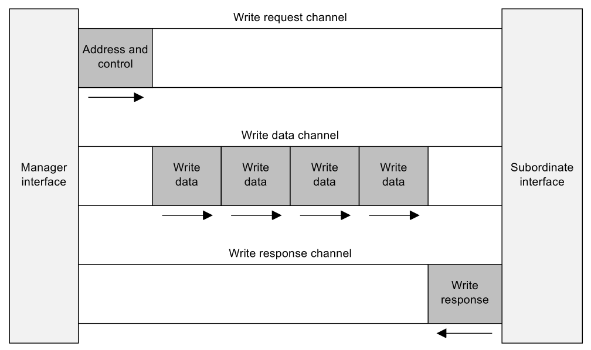
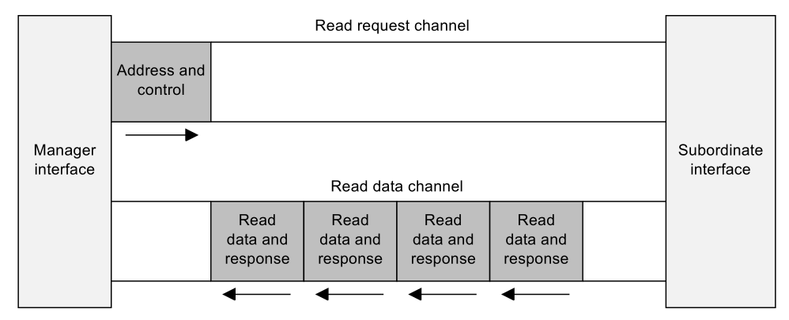

Một giao dịch (transaction) trong AXI là tập hợp một số transfer. Một giao dịch ghi bao gồm:
- Một yêu cầu ghi truyền trên kênh `AW` từ master, bao gồm địa chỉ để ghi;
- Một hoặc nhiều dữ liệu ghi trên kênh `W` từ master;
- Một phản hồi ghi trên kênh `B` từ slave, truyền sau dữ liệu ghi cuối cùng để xác nhận là giao dịch đã hoàn tất.

Tương tự, một giao dịch đọc bao gồm:
- Một yêu cầu đọc trên kênh `AR` từ master, bao gồm địa chỉ để đọc;
- Một hoặc nhiều dữ liệu đọc trên kênh `R`.

Mỗi kênh đều có 2 tín hiệu `VALID` và `READY` riêng, ví dụ `AWVALID` và `AWREADY`, `WVALID` và `WREADY`, `BVALID` và `BREADY`, vân vân.
`VALID` được điều khiển bởi bên gửi, bằng 1 khi dữ liệu trong kênh hợp lệ (valid).
`READY` được điều khiển bởi bên nhận, bằng 1 khi sẵn sàng (ready) nhận dữ liệu từ kênh.
Dữ liệu sẽ được truyền trong kênh khi cả `VALID` và `READY` đều bằng 1.
Các kênh truyền dữ liệu độc lập với nhau. Ví dụ khi `WVALID` và `WREADY` bằng 1
thì dữ liệu trên kênh `W` sẽ được truyền, không quan tâm đến trạng thái các kênh khác.

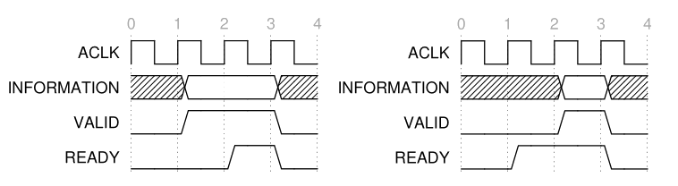

> Lưu ý là `VALID` và `READY` là phụ thuộc bên gửi và nhận chứ không phải master và slave.
> Ví dụ `AW` truyền từ master đến slave, thì `AWVALID` là ngõ vào của slave (ngõ ra của master), và `AWREADY` là ngõ ra của slave.
> Ngược lại, `B` truyền từ slave về master, thì `BVALID` là ngõ ra của slave, và `BREADY` là ngõ vào của slave.

Do có kênh riêng cho đọc và ghi, AXI có thể hỗ trợ đọc và ghi đồng thời (full-duplex), trong khi AHB là half-duplex (chỉ đọc hoặc ghi).
Ngoài ra AXI cho phép master gửi yêu cầu mới khi chưa nhận được phản hồi của giao dịch trước.
Hãy nhớ lại là trong AHB, master chỉ được gửi yêu cầu mới (address phase) khi có được phản hồi của transfer trước đó (data phase).
Như vậy, chúng ta có thể áp dụng pipeline tùy thích, bao nhiêu bước cũng được khi thiết kế một slave AXI.
Trong khi đó, một slave AHB bắt buộc chỉ có 2 bước trong pipeline (address và data phase).
Vì lý do này, tần số clock của AXI có thể được đẩy lên rất cao so với AHB.

Thiết kế đơn giản nhất cho một slave AXI là sử dụng 5 FIFO (first in first out, còn được gọi là queue), mỗi FIFO cho mỗi kênh.

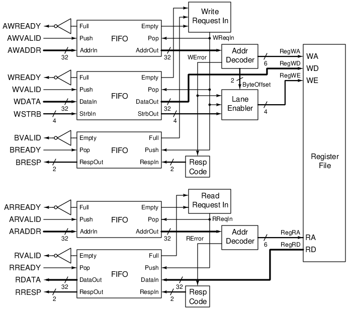

Tín hiệu `VALID` và `READY` có thể được nối thẳng với `Full` và `Push` (còn gọi là `WriteEnable`)
cho kênh nhận, hay là `Empty` và `Pop` (còn gọi là `ReadEnable`) cho kênh gửi.
Ở đầu bên kia, chúng ta chỉ xử lý một giao dịch ghi (tín hiệu `WReqIn`) khi kênh `AW` và `W` có dữ liệu, và kênh `B` còn chỗ trống.
Logic này được thực hiện ở khối `Write Request In`. Khối `Read Request In` cũng tương tự nhưng cho giao dịch đọc.
Sau một số khối để xử lý địa chỉ đầu vào (`Addr Decoder` và `Lane Enabler`),
dữ liệu được ghi và đọc vào một register file có 2 cổng ghi đọc riêng biệt.

## So sánh APB, AHB, và AXI
Dựa vào nguyên lý hoạt động, ta có bảng so sánh sau đây:

| Tiêu chí | APB | AHB | AXI |
| --- | --- | --- | --- |
| Độ phức tạp | Đơn giản | Trung bình | Phức tạp |
| Duplex | Half-duplex | Half-duplex | Full-duplex |
| Thông lượng tối đa | 0.5/clock đọc *hoặc* ghi | 1/clock đọc *hoặc* ghi | 1/clock đọc *và* ghi |
| Tần số clock | Thấp | Trung bình | Cao |
| Gửi yêu cầu tiếp theo khi | Sau khi nhận data trước | Trong khi nhận data trước | Không giới hạn |
| Pipeline | Không có | 2 bước | Nhiều bước |
| Thiết kế cơ bản | Mạch tổ hợp | Thanh ghi | FIFO |

Do những sự khác biệt trên, APB được sử dụng cho các module đơn giản như GPIO hay giao tiếp serial như I2C, SPI, UART.
Cho những ứng dụng khác thì thường AHB và AXI sẽ được sử dụng. AHB đơn giản hơn AXI nhưng lại không hỗ trợ pipeline (trên 2 bước),
cho nên những module có độ trễ cao sẽ phải dùng AXI. Đồng thời, vì AXI cho phép pipeline nhiều bước, tần số AXI cũng có thể được đẩy lên cao,
do đó tăng thông lượng cho những module cần truyền nhiều dữ liệu như đồ họa hoặc Ethernet/WiFi.

Nếu các bạn muốn tìm hiểu hơn về ba giao thức này, xin hãy tham khảo thêm specification của ARM (link bên dưới). Cảm ơn các bạn đã theo dõi.

## Tham khảo
1. APB specification: https://developer.arm.com/documentation/ihi0024/latest/
2. AHB specification: https://developer.arm.com/documentation/ihi0033/latest/
3. AXI specification: https://developer.arm.com/documentation/ihi0022/latest/
4. Thiết kế tham khảo: [APB register](https://github.com/minhcly95/ChipDesignPractice/tree/main/apb_register),
[AHB register](https://github.com/minhcly95/ChipDesignPractice/tree/main/ahb_register),
[AXI register](https://github.com/minhcly95/ChipDesignPractice/tree/main/axi_register)
