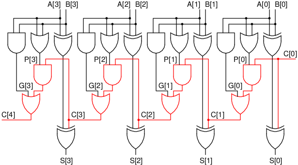

# Nguyên lý và Thiết kế của Prefix adder

Prefix adder là một biến thể của bộ cộng (adder), có chung chức năng là
cộng 2 số `A` và `B` (rộng `N` bit), kèm theo nhớ vào `Cin` (1 bit),
và trả về tổng `S` (rộng `N` bit) và nhớ ra `Cout` (1 bit).
So với bộ cộng đơn giản (ripple-carry adder), prefix adder có delay theo hàm log,
nhanh hơn so với delay tuyến tính (linear) của ripple-carry adder, đặc biệt khi `N` càng lớn.

## Ripple-carry adder
Ripple-carry adder là dạng bộ cộng đơn giản nhất, được tạo ra bằng cách nối `N` full adder (FA) lại với nhau,
`Cout` của FA trước nối `Cin` của FA sau.


Khi cộng, bit nhớ `C[0]` đầu tiên phải đi qua FA thứ nhất biến thành `C[1]`, rồi đi qua FA thứ hai để biến thành `C[2]`,...
Sau khi bit nhớ đó đi qua tất cả các FA, chúng ta mới có kết quả cuối cùng. Do số lượng FA cần phải đi qua là `N`,
delay của bộ cộng này là tuyến tính. Nếu `N` tăng thêm 2 lần, delay cũng sẽ tăng thêm 2 lần.

## Sinh nhớ (Generate) và Truyền nhớ (Propagate)
Chúng ta có thể thấy rằng việc tính toán các bit nhớ `C[i]` là trở ngại lớn nhất trong bộ cộng.
Nếu chúng ta biết được hết các bit nhớ `C[0],C[1],C[2],...`, chúng ta có thể cộng mỗi bit một cách riêng lẻ bằng cổng `XOR`:


```
S[i] = A[i] ^ B[i] ^ C[i]
```

Tuy nhiên, làm thế nào để có thể biết được hết các bit nhớ cùng một lúc?
Chúng ta sẽ tạo ra một logic riêng để tính toán các bit nhớ này một cách nhanh nhất.

Với mỗi bit `i` (từ `0` tới `N-1`), ta tạo ra 2 biến:
- `G[i]`: bằng `1` nếu bit `i` sinh nhớ (generate), khi mà
`Cout = C[i+1]` của bit này luôn là `1`, **không phụ thuộc** vào `Cin = C[i]`.
- `P[i]`: bằng `1` nếu bit `i` truyền nhớ (propagate), khi mà
`Cout` của bit này **phụ thuộc** `Cin`, tức nếu `Cin = 0` thì `Cout = 0`, nếu `Cin = 1` thì `Cout = 1`.

Hai biến `G[i]` và `P[i]` chỉ phụ thuộc vào `A[i]` và `B[i]` mà không phụ thuộc vào `C[i]` (xem bảng).
Do đó, chúng có thể được tính ngay khi ta nhận được `A` và `B` mà không cần phải chờ vào các bit nhớ `C[i]`.

| `A[i]` | `B[i]` | `Cout` | `G[i]` | `P[i]` |
| --- | --- | --- | --- | --- |
| 0 | 0 | `Cout = 0` | 0 | 0 |
| 0 | 1 | `Cout = Cin` | 0 | 1 |
| 1 | 0 | `Cout = Cin` | 0 | 1 |
| 1 | 1 | `Cout = 1` | 1 | 0 |

```
G[i] = A[i] & B[i]
P[i] = A[i] | B[i]
```

Với `G[i]` và `P[i]`, ta có thể tính bit nhớ bằng công thức:
```
C[i+1] = G[i] | P[i] & C[i]
```
Công thức này nghĩa là `C[i+1] = 1` nếu bit nhớ được sinh ra ngay tại đây, hoặc là nó được truyền từ bit trước (và bit trước có nhớ). 
Sử dụng công thức này, ta có thể vẽ lại mạch như sau:



Mặc dù `G[i]` và `P[i]` được tính toán một cách song song ở mỗi bit, chúng ta vẫn phải chờ `C[0]` để tính `C[1]`, chờ `C[1]` để tính `C[2]`,...
Như vậy, `C[i]` vẫn phải đi qua `N` cụm `AND-OR` (màu đỏ trong hình), và delay của mạch này vẫn là tuyến tính.

## Generate và Propagate trên khoảng
Ngoài `G[i]` và `P[i]` cho từng bit, chúng ta cũng có `G[j:i]` và `P[j:i]` cho một khoảng bit từ bit `j` đến bit `i`:
- `G[j:i] = 1` nếu `C[j+1]` luôn bằng `1` và không phụ thuộc vào `C[i]`.
- `P[j:i] = 1` nếu `C[j+1]` phụ thuộc vào `C[i]`, tức là `C[j+1] = C[i]`.

Tương tự với trường hợp 1 bit, ta có:
```
C[j+1] = G[j:i] | P[j:i] & C[i]
```

Bằng cách khai triển công thức ở trên, ta có thể tính được `G[j:i]` và `P[j:i]` dựa trên `G[j],...,G[i]` và `P[j],...,P[i]`.
Ví dụ:
```
C[i+2] = G[i+1] | P[i+1] & C[i+1]
       = G[i+1] | P[i+1] & (G[i] | P[i] & C[i])
       = (G[i+1] | P[i+1] & G[i]) | (P[i+1] & P[i]) & C[i]
```
Do đó,
```
G[i+1:i] = G[i+1] | P[i+1] & G[i]
P[i+1:i] = P[i+1] & P[i]
C[i+2]   = G[i+1:i] | P[i+1:i] & C[i]
```

Tương tự, ta có thể tách `G[j:i]` thành 2 phần `G[j:k]` và `G[k-1:i]` sử dụng chung công thức:
```
G[j:i] = G[j:k] | P[j:k] & G[k-1:i]
P[j:i] = P[j:k] & P[k-1:i]
```

Ta sẽ sử dụng lại công thức này rất nhiều, do đó ta sẽ tạo ra một module `merge` như sau:
```systemverilog
module merge(input logic ga, pa, gb, pb,
             output logic go, po);
    assign go = ga | pa & gb;
    assign po = pa & pb;
endmodule
```


## Prefix adder
Chúng ta trở lại mục tiêu ban đầu là tính mọi bit nhớ `C[i]` nhanh nhất có thể cùng một lúc.
Thay vì tính `C[i+1]`, chúng ta sẽ tính `G[i:0]` và `P[i:0]`. Lưu ý rằng:
```
C[i+1] = G[i:0] | P[i:0] & C[0]
```

> Trong thực tế thì chúng ta muốn tính thẳng `G[i:-1]` bởi vì `C[i+1] = G[i:-1]` (nếu ta đặt `G[-1] = C[0]`).
> Tuy nhiên, việc sử dụng `G[i:0]` sẽ giúp giải thích nguyên lý dễ hơn.

Điều sáng tạo ở prefix adder là cách mà chúng ta tính `G[i:0]` và `P[i:0]`.
Ví dụ, nếu ta có `N = 8`. Ở bước đầu tiên, ta sẽ tính song song:
```
G[7:6] = G[7] | P[7] & G[6];    P[7:6] = P[7] & P[6];
G[6:6] = G[6];                  P[6:6] = P[6];

G[5:4] = G[5] | P[5] & G[4];    P[5:4] = P[5] & P[4];
G[4:4] = G[4];                  P[4:4] = P[4];

G[3:2] = G[3] | P[3] & G[2];    P[3:2] = P[3] & P[2];
G[2:2] = G[2];                  P[2:2] = P[2];

G[1:0] = G[1] | P[1] & G[0];    P[1:0] = P[1] & P[0];
G[0:0] = G[0];                  P[0:0] = P[0];
```
Lưu ý rằng các bước tính đều sử dụng module `merge` ở trên. Ở bước thứ hai, ta sẽ tính song song:
```
G[7:4] = G[7:6] | P[7:6] & G[5:4];      P[7:4] = P[7:6] & P[5:4];
G[6:4] = G[6:6] | P[6:6] & G[5:4];      P[6:4] = P[6:6] & P[5:4];
// G[5:4], P[5:4] đã tính ở bước trước
// G[4:4], P[4:4] đã tính ở bước trước

G[3:0] = G[3:2] | P[3:2] & G[1:0];      P[3:0] = P[3:2] & P[1:0];
G[2:0] = G[2:2] | P[2:2] & G[1:0];      P[2:0] = P[2:2] & P[1:0];
// G[1:0], P[1:0] đã tính ở bước trước
// G[0:0], P[0:0] đã tính ở bước trước
```
Cuối cùng, ở bước thứ ba, chúng ta sẽ tính:
```
G[7:0] = G[7:4] | P[7:4] & G[3:0];      P[7:0] = P[7:4] & P[3:0];
G[6:0] = G[6:4] | P[6:4] & G[3:0];      P[6:0] = P[6:4] & P[3:0];
G[5:0] = G[5:4] | P[5:4] & G[3:0];      P[5:0] = P[5:4] & P[3:0];
G[4:0] = G[4:4] | P[4:4] & G[3:0];      P[4:0] = P[4:4] & P[3:0];
// G[3:0], P[3:0] đã tính ở bước trước
// G[2:0], P[2:0] đã tính ở bước trước
// G[1:0], P[1:0] đã tính ở bước trước
// G[0:0], P[0:0] đã tính ở bước trước
```
Ba bước trên có thể được tóm tắt lại bằng biểu đồ:


Mỗi dây trên biểu đồ bao gồm 2 bit cho `G[j:i]` và `P[j:i]`.
Ô đen biểu thị cho module `merge` ở phần trước.
Khi chúng ta `merge` 2 nhánh `j:k` và `k-1:i`, ta sẽ có `j:i`.
Ví dụ, `merge` 2 nhánh `5:4` và `3:0` sẽ sinh ra `5:0`.
Biểu đồ này được gọi là cây prefix (prefix tree).

> Có nhiều dạng cây prefix khác nhau. Cây vừa được mô tả là được gọi là cây Sklansky.

Như vậy, chỉ sau 3 bước tính, ta đã có được `G[i:0]` và `P[i:0]` cho mọi `i`. Nếu `N = 16` thì chúng ta chỉ cần thêm 1 bước, tổng cộng 4 bước.
Nếu `N = 32` thì ta cần 5 bước, nếu `N = 64` thì cần 6 bước,... Như vậy, số bước cần thực hiện chỉ là `log N` chứ không phải tuyến tính.
Đây là ví dụ cho một cây prefix rộng 32 bit:


Sau khi `G[i:0]` và `P[i:0]` được tính, bước cuối cùng là tính `C[i]` và tổng `S[i]` cho từng bit:
```
C[i] = G[i-1:0] | P[i-1:0] & C[0]
S[i] = A[i] ^ B[i] ^ C[i]
```

Tổng hợp lại, prefix adder có thể cộng 2 số `A` và `B` qua các bước:
1. Tính `G[i]` và `P[i]` cho từng bit dựa vào `A` và `B`.
2. Tính `G[i:0]` và `P[i:0]` từ `G[i]` và `P[i]` sử dụng cây prefix trong `log N` bước.
3. Tính `C[i]` từ `G[i:0]`, `P[i:0]`, và `C[0]`.
4. Tính tổng `S[i]` cho mỗi bit.


Như vậy, prefix adder đã giải quyết được vấn đề chờ `C[i]` để tính `C[i+1]` bằng cách thu thập rất nhiều dữ liệu từ `A` và `B`
để tính `C[i+1]` trực tiếp từ `C[0]` mà không cần phải qua trung gian `C[i],...,C[1]`.
Bằng cách này, delay của prefix adder chỉ tỉ lệ với `log N`. Với `N` lớn, delay của prefix adder sẽ nhỏ hơn đáng kể
so với ripple-carry adder.

## Code bằng SystemVerilog
Trong phần này chúng ta sẽ code một module `prefix_adder` để cộng 2 số 8-bit.
Ta mô tả module `prefix_adder` qua 4 bước:
```systemverilog
module prefix_adder(
    input logic[7:0] a, b,
    input logic cin,
    output logic [7:0] s,
    output logic cout
);

    // g[i] = G[i], trong khi gg[i] = G[i:0]
    logic[7:0] g, p, gg, pp;
    logic[8:0] c;

    // Buoc 1: Tinh G[i] va P[i]
    assign g = a & b;
    assign p = a | b;

    // Buoc 2: Tinh G[i:0] va P[i:0] su dung module prefix
    prefix #(8) pref(g, p, gg, pp);

    // Buoc 3: Tinh C[i]
    assign c[0] = cin;
    assign cout = c[8];
    assign c[8:1] = gg | pp & {8{c[0]}};

    // Buoc 4: Tinh S[i]
    assign s = a ^ b ^ c[7:0];
endmodule
```
Module `prefix` sẽ mô tả cây prefix trong phần trước. Thoạt nhìn thì cây này khá rắc rối.
Tuy nhiên, chúng ta sẽ tận dụng cấu trúc đệ quy (recursive structure) của cây này bao gồm:
- Hai cây `prefix` có độ rộng 4 bit (màu xanh lá trong hình dưới), một cho 4 bit cao và một cho 4 bit thấp.
- Một loạt các module `merge` (màu xanh dương) để kết hợp 4 bit cao với `G[3:0]` và `P[3:0]`.


Trong 2 cây prefix có độ rộng 4 bit, cấu trúc đệ quy này lại xuất hiện, mỗi cây lại có thêm 2 cây `prefix` có độ rộng 2 bit (màu đỏ).
Chúng ta có thể khai triển cho đến khi chúng ta còn 1 bit. Khi này, ta chỉ cần nối dây trực tiếp (vì `G[i:i] = G[i]` và `P[i:i] = P[i]`).
Chúng ta dùng `parameter N` để chỉ ra độ rộng của cây prefix.
```systemverilog
module prefix #(parameter N = 8)(
    input logic[N-1:0] g, p,
    output logic[N-1:0] gg, pp
);
    localparam M = N/2;

    genvar i;
    generate
        if (N === 1) begin
            // Base case: chi con 1 bit, noi truc tiep
            assign gg = g;
            assign pp = p;
        end
        else begin
            // Recursive case: tao 2 cay prefix co do rong M
            logic[M-1:0] ghigh, phigh, glow, plow;
            prefix #(M) highpref(g[N-1:M], p[N-1:M], ghigh, phigh);
            prefix #(M) lowpref(g[M-1:0], p[M-1:0], glow, plow);
            // Merge
            assign gg[M-1:0] = glow;
            assign pp[M-1:0] = plow;
            for (i = 0; i < M; i++)
                merge m(ghigh[i], phigh[i], glow[M-1], plow[M-1], gg[M+i], pp[M+i]);
        end
    endgenerate
endmodule
```
Testbench sau đây có thể được dùng để kiểm tra code trên:
```systemverilog
module testbench();
    logic[7:0] a, b, s;
    logic cin, cout;

    int unsigned expected;
    int num_errors = 0;

    prefix_adder dut(a, b, cin, s, cout);

    initial begin
        for (int i = 0; i < 256; i++) begin
            a = $urandom;
            b = $urandom;
            cin = $urandom;
            expected = a + b + cin;
            #1;
            if (expected !== {cout, s}) begin
                $display("Error: a = %b, b = %b, cin = %b, result = %b, expected = %b",
                        a, b, cin, {cout, s}, expected[8:0]);
                num_errors++;
            end
            #1;
        end
        $display("Test finished with %3d errors.", num_errors);
    end
endmodule
```
Code cho bài viết này có thể được tìm thấy ở [prefix_adder.sv](prefix_adder.sv) và [testbench.sv](testbench.sv).
Cảm ơn các bạn đã theo dõi.
