# Căn bản về giải thuật tính Prefix song song

Trong thiết kế, nhiều khi chúng ta gặp những biểu thức cộng dồn dưới dạng:
$$
\begin{aligned}
Y_0 &= A_0 \\
Y_1 &= A_0 + A_1 \\
Y_2 &= A_0 + A_1 + A_2 \\
Y_3 &= A_0 + A_1 + A_2 + A_3
\end{aligned}
$$

> Bài viết này sẽ sử dụng ký hiệu trong đại số Bool. Điều này có nghĩa là `A | B` (`A` hay `B`) sẽ được viết thành $A + B$,
> `A & B` (`A` và `B`) sẽ được viết thành $AB$ hay $A \cdot B$, và `~A` (nghịch `A`) sẽ trở thành $\overline{A}$.

Những tổng cộng dồn này ($Y_0, Y_1, Y_2, Y_3$) được gọi là **prefix** (gọi tắt của từ prefix sum).
Những prefix này có thể được tính một cách song song trong `log N` bước sử dụng một cấu trúc gọi là *cây prefix*.
Kỹ thuật này nói chung được gọi là *giải thuật tính prefix song song* (parallel-prefix algorithm).

> Kỹ thuật tính prefix song song cũng đã được đề cập trong bài [prefix adder](../PrefixAdder/PrefixAdder.md).
> Bài này sẽ mô tả về ứng dụng của kỹ thuật này trong các bài toán đơn giản hơn.

## Tính OR cộng dồn
Cho một mảng 8 bit $[A_7, A_6, \ldots, A_0]$, bài toán đầu tiên của chúng ta
là tạo ra một mạch để tính một mảng OR cộng dồn cũng 8 bit $[Y_7, Y_6, \ldots, Y_0]$ sao cho:
$$
\begin{aligned}
Y_0 &= A_0 \\
Y_1 &= A_0 + A_1 \\
Y_2 &= A_0 + A_1 + A_2 \\
    &~~\vdots \\
Y_6 &= A_0 + A_1 + \cdots + A_6 \\
Y_7 &= A_0 + A_1 + \cdots + A_6 + A_7
\end{aligned}
$$

Nói nôm na cho dễ hiểu là mạch này sẽ tìm ra bit bằng 1 đầu tiên từ bên phải và
trả về 1 cho những bit bên trái bit đó.

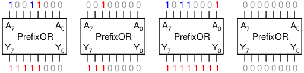

> Chúng ta sẽ vẽ các mạch trong bài này từ trên xuống dưới thay vì từ trái sang phải.

> Mã theo dạng `11111000` hay `11100000` được gọi là mã nhiệt kế (thermometer code).

Đầu tiên, ta gọi:
$$ A_{i:j} = A_i + A_{i+1} + \cdots + A_j $$
Ví dụ, $A_{5:2} = A_5 + A_4 + A_3 + A_2$. Theo định nghĩa này thì ta có $Y_0 = A_{0:0}$, $Y_1 = A_{1:0}$, $Y_2 = A_{2:0}$,
và vân vân.

Giả sử rằng ta chỉ cần tính $Y_7$. Để tính $Y_7 = A_{7:0}$ trong `log N` bước là một chuyện khá là đơn giản.
Ta sẽ tính OR theo từng cặp trong bước 1 (tứ kết):
$$
\begin{aligned}
A_{7:6} &= A_7 + A_6 &\qquad 
A_{5:4} &= A_5 + A_4 &\qquad
A_{3:2} &= A_3 + A_2 &\qquad
A_{1:0} &= A_1 + A_0
\end{aligned}
$$
Sau đó ta ghép 2 cặp liền kề với nhau trong bước 2 (bán kết):
$$
\begin{aligned}
A_{7:4} &= A_{7:6} + A_{5:4} &\qquad
A_{3:0} &= A_{3:2} + A_{1:0}
\end{aligned}
$$
Và trong bước 3, ta tính OR của cặp còn lại (chung kết):
$$
Y_7 = A_{7:0} = A_{7:4} + A_{3:0}
$$
Các bước tính toán trên có thể được biểu diễn dưới dạng cây:

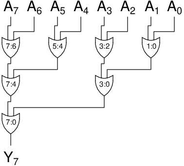

Ta có thể thấy là mỗi khi ta gộp $A_{i:j}$ và $A_{j+1:k}$ lại với nhau thì ta sẽ có $A_{i:k}$.

Vấn đề bây giờ của chúng ta là tính tất cả $Y_7, Y_6, \ldots, Y_0$ cùng một lúc trong `log N` bước (mà sử dụng ít cổng logic nhất có thể).
Chúng ta làm điều này bằng cách chỉnh sửa cái cây dùng để tính $Y_7$.
Ta bắt đầu với $Y_6 = A_{6:0}$. Sử dụng các dữ kiện đã sử dụng cho $Y_7$, ta có thể thấy:
$$ Y_6 = A_{6:0} = A_6 + A_{5:4} + A_{3:0} $$
Như vậy, chúng ta chỉ cần gộp $A_6$ và $A_{5:4}$ thành $A_{6:4}$, sau đó gộp nó với $A_{3:0}$ để tạo thành $A_{6:0}$.

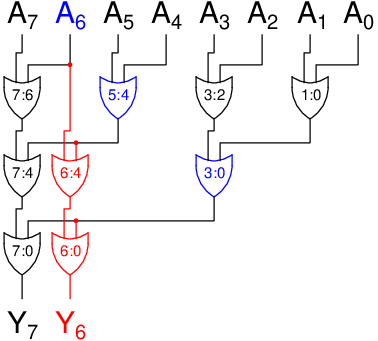

Làm điều tương tự với $Y_5, Y_4, \ldots, Y_0$, ta có cây như sau:

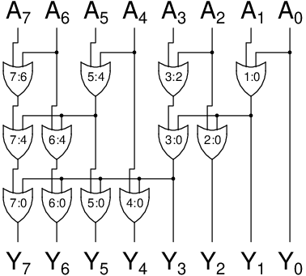

Cây này được gọi là cây prefix (theo dạng Sklansky). Thông thường, chúng ta sẽ thay các cổng OR bằng cách ô đen để tiết kiệm không gian,
đồng thời cũng giúp biểu đồ dễ đọc hơn.

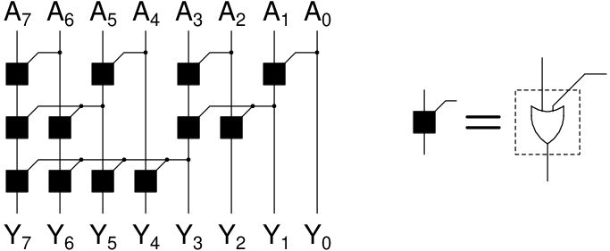

> Có nhiều dạng cây prefix khác nhau như Kogge-Stone hay Brent-Kung, mỗi loại đều có ưu điểm và nhược điểm riêng.
> Ví dụ cây Sklansky có ít tầng logic nhất, nhưng lại chia nhánh (fanout) nhiều, sẽ làm tăng delay cho mỗi tầng.

Số tầng trong cây prefix là `log N`, với `N` là chiều dài của mảng $[A_{N-1}, A_{N-2}, \ldots, A_0]$.
Cho nên, một cây prefix rộng 32 bit chỉ cần 5 tầng:

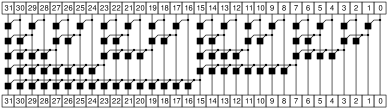

> Cây prefix có thể được mô tả bằng cấu trúc đệ quy.
> Xin tham khảo bài [prefix adder](../PrefixAdder/PrefixAdder.md) để xem cách code cấu trúc này như thế nào.

## Tính AND cộng dồn
Tương tự với bài toán OR cộng dồn, ta cũng có bài toán AND cộng dồn.
$$
\begin{aligned}
Y_0 &= A_0 \\
Y_1 &= A_0 A_1 \\
Y_2 &= A_0 A_1 A_2 \\
    &~~\vdots \\
Y_7 &= A_0 A_1 A_2 \cdots A_7
\end{aligned}
$$

Thay vì tìm bit 1 đầu tiên, mạch AND cộng dồn sẽ tìm bit 0 đầu tiên, và trả về 0 cho các bit bên trái bit đó:

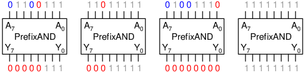

Chúng ta có thể áp dụng cây prefix ở trên cho bài toán này. Ta chỉ cần thay các ô đen trong cây prefix thành các cổng AND.
Đây là ví dụ cho một mạch AND cộng dồn rộng 8 bit.

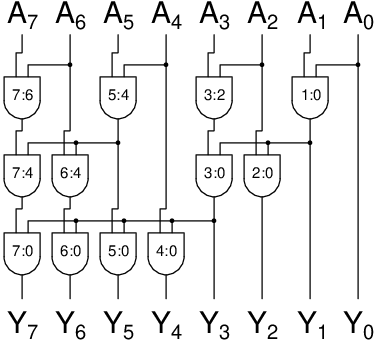

Mạch OR và AND cộng dồn có thể được ứng dụng trong việc thiết kế rất nhiều mạch khác.
Chức năng của mạch OR cộng dồn là **tìm ra bit bằng 1 đầu tiên**, còn của mạch AND cộng dồn là **tìm ra bit bằng 0 đầu tiên**.
Sau đây sẽ là hai ứng dụng của các mạch nêu trên.

> Thật ra nếu chúng ta lật cả ngõ vào và ngõ ra từ 1 thành 0, từ 0 thành 1,
> thì mạch AND cộng dồn sẽ trở thành mạch OR cộng dồn và ngược lại (định lý De Morgan).

## Mạch mã hóa ưu tiên
Mạch mã hóa ưu tiên (priority encoder) là mạch sẽ trả về vị trí của bit bằng 1 cao nhất.
Tuy nhiên, trong bài này, ta sẽ không mã hóa nó theo dạng nhị phân, mà trả về vị trí bit đó theo dạng one-hot.
Ví dụ, nếu ngõ vào của mạch là `00100101` thì mạch sẽ trả về giá trị `00100000` bởi vì bit thứ 5 là bit bằng 1 cao nhất.

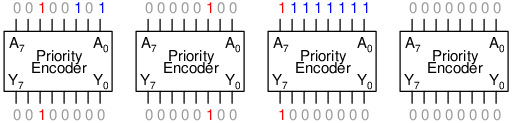

Ngay từ khi đọc mô tả của mạch thì chúng ta có thể thấy ngay là ta có thể sử dụng mạch OR cộng dồn (tìm **bit bằng 1 cao nhất**).
Điểm khác biệt duy nhất là ta phải tìm bit bằng 1 đầu tiên từ *trái* sang (thay vì từ phải sang).
Để tìm từ trái sang thì chúng ta chỉ cần lật cây prefix từ trái sang phải:

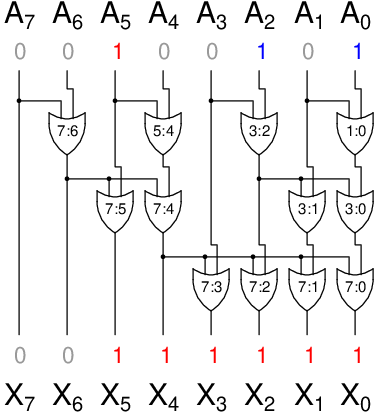

Cây prefix này sẽ trả về mã nhiệt kế theo dạng `00111111`.
Bước tiếp theo là biến đổi mã nhiệt kế này thành dạng one-hot `00100000`.
Ta sẽ sử dụng *mạch lọc cạnh lên* để phát hiện ra chuỗi 2 bit `01` đứng liền kề:

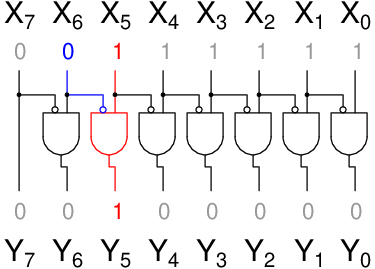

Tổng hợp lại, ta có thiết kế mạch mã hóa ưu tiên như sau:

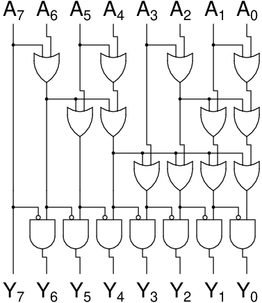

Code và testbench cho thiết kế này có thể được tìm thấy ở [pe_onehot.sv](pe_onehot.sv) và [pe_onehot_tb.sv](pe_onehot_tb.sv).

## Mạch bù hai
Mạch bù hai (two's complementer) là mạch trả về số âm của ngõ vào dưới dạng bù hai (two's complement).
Ví dụ, bù hai của `00010100` (`20` trong thập phân) là `11101100` (`-20` trong thập phân).
Thoạt nhìn thì mạch này chẳng có liên quan gì tới mạch OR hay AND cộng dồn.
Tuy nhiên, hãy quan sát các ví dụ sau đây trong hình:

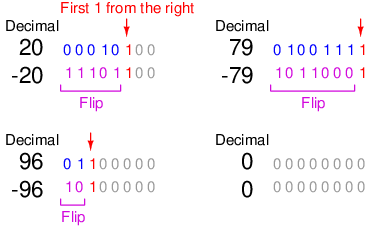

Như vậy, ta có thể lấy số bù hai bằng thuật toán sau:
1. Tìm **bit bằng 1 đầu tiên** từ phải sang.
2. Lật (flip) tất cả các bit ở bên trái bit đó (bỏ qua bit tìm được ở trên).

A ha, chúng ta có thể dùng mạch OR cộng dồn để giải quyết bước 1.
Kết quả của bước 1 là một mã nhiệt kế `X`. Để thực hiện bước 2, ta cần lật các bit ở bên trái nhưng bỏ qua vị trí bit tìm được.
Như vậy, ta cần dịch (shift) mã nhiệt kế này sang trái 1 bit `Z = X << 1`, và sau đó áp dụng cổng XOR với ngõ vào `A` để cho ra kết quả cuối cùng `Y = A ^ Z`.

> Cổng XOR sẽ lật `A[i]` khi `Z[i] = 1`, giữ nguyên `A[i]` khi `Z[i] = 0`.

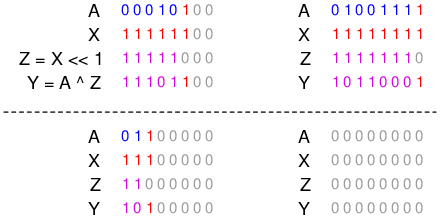

Tổng hợp lại các bước trên, ta có mạch bù hai như sau:

> Ta có thể bỏ qua các cổng cho `X[7]` bởi vì sau khi dịch bit thì `X[7]` sẽ biến mất.

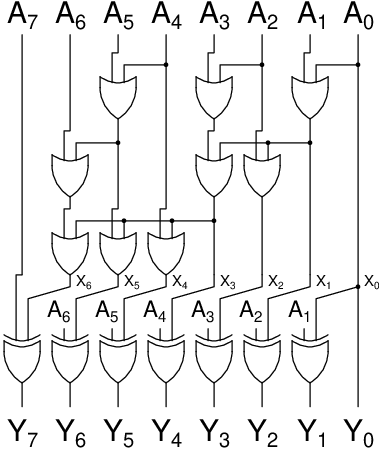

Code và testbench cho thiết kế này có thể được tìm thấy ở [twocomp.sv](twocomp.sv) và [twocomp_tb.sv](twocomp_tb.sv).

## Bài tập

Phương pháp trên còn được áp dụng cho nhiều bài toán khác:
- Mạch so sánh nhỏ hơn: dùng XOR để so sánh bằng từng bit (`A[i] == B[i]` khi `A[i] ^ B[i] == 0`),
sau đó dùng mạch OR cộng dồn để tìm ra **bit không bằng nhau đầu tiên**.
Tham khảo bài [bộ so sánh đệ quy](../RecursiveComparator/RecursiveComparator.md) để biết cách sử dụng dữ kiện này như thế nào.
- Mạch đếm (counter): bạn hãy làm một vài ví dụ trên giấy để tìm ra quy luật lật bit.
Cụ thể là chúng ta sẽ lật các bit từ phải sang cho đến khi ta tìm được **bit bằng 0 đầu tiên**.
Sau đó hãy sử dụng kỹ thuật được mô tả trong mạch bù hai.

Nếu các bạn mong muốn áp dụng những kiến thức vừa đọc được, hãy thử giải những bài tập trên.
Cám ơn các bạn đã theo dõi.

## Tham khảo
1. CMOS VLSI Design: A Circuits and Systems Perspective (4th edition) - Neil H. E. Weste, David M. Harris
2. MIT lecture note: http://courses.csail.mit.edu/18.337/2004/book/Lecture_03-Parallel_Prefix.pdf

