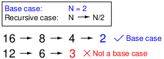
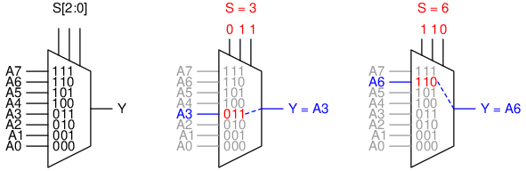
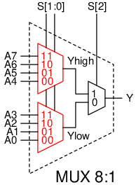
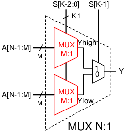
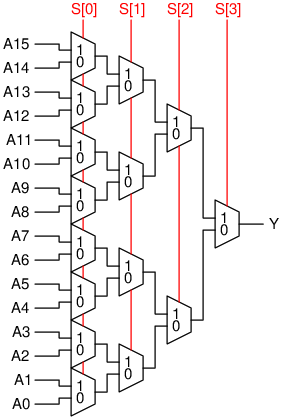
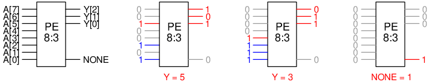
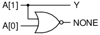
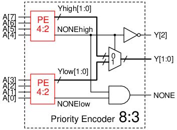
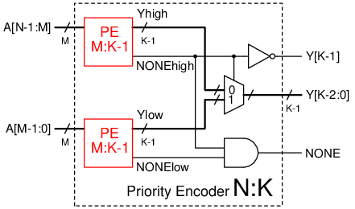
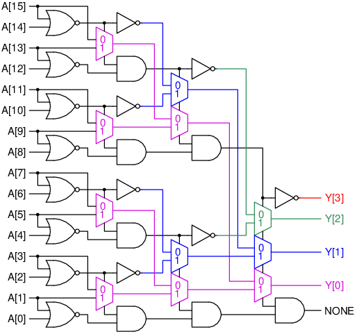

# Căn bản về Đệ quy trong Thiết kế Phần cứng

Cấu trúc đệ quy (recursive structure) là một cấu trúc sử dụng lại một phiên bản nhỏ hơn của chính nó.
Ví dụ, một MUX `32:1` có thể được cấu thành từ 2 MUX `16:1`, và mỗi MUX `16:1` lại được tạo ra từ 2 MUX `8:1`,
và vân vân cho đến khi chỉ còn lại MUX `2:1`.
Ngoài việc cấu trúc đệ quy cho ta một mô tả tổng quát hơn, giải quyết vấn đề theo hướng chia để trị (divide and conquer)
cũng là những bài tập khá thú vị (theo ý kiến chủ quan của mình).
Trong bài này, mình sẽ giới thiệu các bước để giải quyết một bài toán thiết kế sử dụng cấu trúc đệ quy.

## Định nghĩa cấu trúc đệ quy
Để có được một cấu trúc đệ quy, bạn cần định nghĩa rõ ràng 2 thứ sau:
- **Phần cơ sở** (Base case): đây là trường hợp nhỏ nhất mà bạn có thể giải một cách dễ dàng.
Thông thường thì đầu vào của phần cơ sở chỉ là 1 bit hoặc 2 bit.
Bạn có thể dùng bảng chân lý (truth table) hay bìa Karnaugh để tạo ra logic cho phần này.
- **Phần đệ quy** (Recursive case): trong phần này, bạn cần phải đưa bài toán về dạng đơn giản hơn,
hay đưa nó về phần cơ sở. Ví dụ, trong phần đệ quy, bạn cần phải tạo module `N` bit từ các module `N/2` bit (hay từ các module `N-1` bit, tùy bài toán).
Đây là phần khó, đòi hỏi sự sáng tạo của người thiết kế.

> Để dễ hình tượng ra phần đệ quy, nên bắt đầu với `N` cụ thể (như `N = 4` hay `N = 8`) rồi suy ra quy luật tổng quát. 

> Giống như mọi kỹ năng khác trong cuộc sống, để quen với phương pháp này thì các bạn phải giải nhiều bài tập theo dạng đệ quy.

Bạn phải đảm bảo rằng phần đệ quy sau khi khai triển thì cuối cùng sẽ dừng ở phần cơ sở.
Ví dụ, MUX `32:1` sẽ khai triển thành MUX `16:1`, rồi thành MUX `8:1`, rồi thành `4:1`, cuối cùng dừng ở `2:1` chính là phần cơ sở.
Tuy nhiên, MUX `12:1` sẽ trở thành MUX `6:1`, rồi sẽ bị kẹt ở MUX `3:1` bởi vì nó không nằm trong định nghĩa phần cơ sở.
Để hỗ trợ MUX `12:1`, bạn có thể nâng nó thành MUX `16:1`, hoặc là định nghĩa một phần cơ sở khác cho MUX `3:1`.



Để rèn luyện khả năng thiết kế cấu trúc đệ quy, chúng ta sẽ thiết kế 2 module theo hướng này:
MUX (multiplexer - mạch ghép kênh) và mạch mã hóa ưu tiên (priority encoder).

## Thiết kế MUX đệ quy
Chức năng của một MUX `N:1` là để ghép `N` kênh lại thành một kênh. Một MUX `N:1` sẽ có các cổng:
- `N` cổng vào `A0, A1, A2, ...` tương ứng với `N` kênh để ghép.
- Một cổng vào `S` có chiều rộng `K = log N` bit để chọn kênh.
- Một cổng ra `Y`. Tùy vào `S` thì `Y` sẽ được nối với kênh tương ứng.
Ví dụ nếu `S = 3` thì `Y = A3`, nếu `S = 6` thì `Y = A6` và vân vân.

> Ta sẽ giả sử mỗi kênh `A0, A1, A2, ...` và `Y` có chiều rộng 1 bit cho đơn giản.



Bài tập của chúng ta sẽ là thiết kế một MUX `N:1` chỉ sử dụng các MUX `2:1` (bao nhiêu tùy thích).
Bước đầu trong thiết kế đệ quy là **phần cơ sở**. Ta sẽ lấy MUX `2:1` làm phần cơ sở của chúng ta (vì nó đã có sẵn trong đề).
Bước tiếp theo là định nghĩa **phần đệ quy**. Giả sử rằng ta đã thiết kế được MUX `N/2:1`, làm sao để ta ghép chúng thành MUX `N:1`?

Đây là nơi mà các bạn cần sử dụng sự sáng tạo của mình. Chúng ta sẽ tận dụng biểu diễn nhị phân của `S` (cổng chọn kênh).
Ví dụ, lấy `N = 8`, ta đã thiết kế được MUX `4:1` và cần ghép chúng lại thành MUX `8:1`.
Nếu bit cao nhất của `S` (là `S[2]`) bằng 0, thì `Y` sẽ chỉ chọn một trong 4 kênh `A0, A1, A2, A3`.
Như vậy, ta có thể sử dụng MUX `4:1` để chọn 4 kênh này (sử dụng `S[1:0]` để chọn kênh).
Tương tự, nếu `S[2] = 1`, thì `Y` sẽ chỉ chọn một trong 4 kênh `A4, A5, A6, A7` và ta sẽ sử dụng một MUX `4:1` khác cho 4 kênh cao.
Cuối cùng, ta dùng thêm một MUX `2:1` để chọn giữa ngõ ra MUX cao `Yhigh` vào MUX thấp `Ylow`.
Tổng hợp lại, ta có mạch như sau:



Về mặt tổng quát, ta có định nghĩa phần đệ quy (với `M = N/2`, `K = log N`):



Như vậy là ta đã thiết kế xong một MUX đệ quy. Chúng ta không cần một định nghĩa riêng cho MUX `4:1`, `16:1`, hay `128:1`.
Thay vào đó, mô tả này là hoàn toàn hợp lệ cho bất kỳ MUX `N:1` nào với `N` là mũ của 2.
Thiết kế này sẽ tự khai triển cho đến khi gặp phần cơ sở, nơi mà phần mạch cuối cùng sẽ được chèn vào.
Đây là khai triển của một MUX `16:1`:



Để mô tả module này bằng SystemVerilog, ta sử dụng `N` và `K` để chỉ ra tham số của MUX,
dùng lệnh `if` trong khối `generate` để phân biệt phần cơ sở với phần đệ quy.
Sau đó là mô tả mỗi phần theo định nghĩa, và gọi lại chính module này với tham số `M = N/2` và `L = K-1`.

```systemverilog
module mux #(
    parameter N = 8,
    parameter K = 3
)(
    input logic[N-1:0] a,
    input logic[K-1:0] s,
    output logic y
);
    localparam M = N/2;
    localparam L = K-1;

    generate
        if (N === 2) begin
            // Base case: MUX 2:1
            assign y = s[0] ? a[1] : a[0];
        end
        else begin
            // Recursive case
            logic yhigh, ylow;
            mux #(M,L) highmux(a[N-1:M], s[L-1:0], yhigh);
            mux #(M,L) lowmux(a[M-1:0], s[L-1:0], ylow);
            assign y = s[K-1] ? yhigh : ylow;
        end
    endgenerate
endmodule
```

Code và testbench cho thiết kế này có thể được tìm thấy ở [mux.sv](mux.sv) và [mux_tb.sv](mux_tb.sv).

## Mạch mã hóa ưu tiên theo dạng đệ quy
Mạch mã hóa ưu tiên (priority encoder) là mạch sẽ trả về vị trí của bit bằng 1 cao nhất.
Ví dụ, nếu ngõ vào của mạch là `00100101` thì mạch sẽ trả về giá trị `5` bởi vì có ba bit bằng 1:
bit 5, bit 2, và bit 0, trong đó bit 5 là bit cao nhất. Với ngõ vào là `00001111` thì mạch sẽ trả về giá trị là `3`.
Một mạch mã hóa ưu tiên `N:K` bit có các cổng sau:
- Cổng vào `A` rộng `N` bit.
- Cổng ra `Y` rộng `K = log N` bit, trả về vị trí của bit bằng 1 cao nhất trong `A`.
- Cổng ra phụ `NONE`, bằng 1 khi không có bit nào trong `A` bằng 1 (tức là `A == 0`), bằng 0 khi `A` khác 0.



Bước 1 là định nghĩa **phần cơ sở**. Ta sẽ lấy trường hợp mạch mã hóa `2:1` làm phần cơ sở.
Dùng bảng chân lý, ta có thể dễ dàng viết được logic của mạch này:

| `A[1]` | `A[0]` | `Y` | `NONE`|
| --- | --- | --- | --- |
| 0 | 0 | 0 | 1 |
| 0 | 1 | 0 | 0 |
| 1 | 0 | 1 | 0 |
| 1 | 1 | 1 | 0 |

```
Y = A[1]
NONE = ~(A[1] | A[0])
```



Với **phần đệ quy** của mạch này, giả sử rằng chúng ta đã thiết kế được mạch mã hóa `4:2`
và cần ghép chúng lại để tạo ra mạch mã hóa `8:3`. Theo *kinh nghiệm* thì ta sẽ dùng 2 bộ mã hóa `4:2`,
một cho 4 bit cao `A[7:4]` và một cho 4 bit thấp `A[3:0]`.
Ta gọi các ngõ ra của bộ mã hóa cao và thấp lần lượt là `Yhigh`, `NONEhigh`, `Ylow`, `NONElow`.
Xét các trường hợp sau:
- `NONEhigh = 0`: tức là có bit bằng 1 trong `A[7:4]`, chúng ta sẽ bỏ qua `Ylow` (do 4 bit cao ưu tiên hơn).
Tận dụng biểu diễn nhị phân của `Y`, `Yhigh` đã chứa các bit thấp của `Y`. Do đó,
ta chỉ cần thêm một số `1` vào đằng trước: `Y = {1'b1, Yhigh}`.
- `NONEhigh = 1`: tức là không có bit bằng 1 trong `A[7:4]`.
Lại tận dụng biểu diễn nhị phân của `Y`, ta chỉ cần thêm một số `0` vào đằng trước: `Y = {1'b0, Ylow}`.

Đúc kết lại thì ta sẽ sử dụng một MUX để lựa chọn giá trị thích hợp cho `Y`.
Mặt khác, `NONE` chỉ trả về 1 khi không có bit nào bằng 1, tức là cả `NONEhigh = 1` và `NONElow = 1`.
Do đó,
```
Y = NONEhigh ? {1'b0, Ylow} : {1'b1, Yhigh}
NONE = NONEhigh & NONElow
```



Mạch của phần đệ quy tổng quát sẽ là:



Đây là khai triển của một mạch mã hóa `16:4` (các MUX nhiều bit đã được thay bằng MUX 1 bit):



Mô tả mạch này bằng SystemVerilog cũng rất giống với phần trước. Chỉ thay định nghĩa của các phần cơ sở và phần đệ quy:
```systemverilog
module priority_enc #(
    parameter N = 8,
    parameter K = 3
)(
    input logic[N-1:0] a,
    output logic[K-1:0] y,
    output logic none
);
    localparam M = N/2;
    localparam L = K-1;

    generate
        if (N === 2) begin
            // Base case
            assign y = a[1];
            assign none = ~(a[1] | a[0]);
        end
        else begin
            // Recursive case
            logic[L-1:0] yhigh, ylow;
            logic nonehigh, nonelow;

            priority_enc #(M,L) highenc(a[N-1:M], yhigh, nonehigh);
            priority_enc #(M,L) lowenc(a[M-1:0], ylow, nonelow);

            assign y = nonehigh ? {1'b0, ylow} : {1'b1, yhigh};
            assign none = nonehigh & nonelow;
        end
    endgenerate
endmodule
```

Code và testbench cho thiết kế này có thể được tìm thấy ở [priority_enc.sv](priority_enc.sv) và [priority_enc_tb.sv](priority_enc_tb.sv).

Cám ơn các bạn đã theo dõi.

