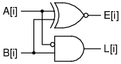
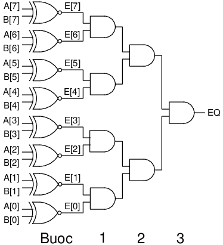
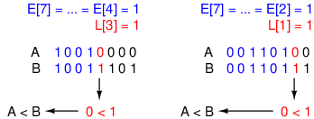
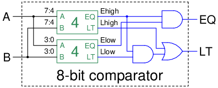
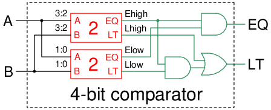
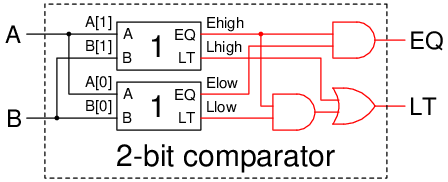
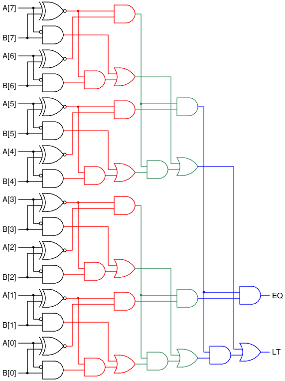

# Bộ so sánh đệ quy (Recursive comparator)

Comparator là một bộ phận dùng để so sánh 2 số `A` và `B` với nhau (rộng `N` bit) và
trả về kết quả rằng `A < B`, `A == B`, hoặc là `A > B`.
Thông thường trong sách chỉ đề cập tới việc sử dụng bộ cộng (adder) để so sánh bằng cách
tính `A - B` rồi kiểm tra xem hiệu là âm hay dương.
Trong bài này, chúng ta sẽ thiết kế một bộ so sánh riêng mà không cần dùng bộ cộng.
Đặc biệt là bộ so sánh của chúng ta sẽ chạy trong `log N` bước.

## So sánh từng bit
Ta bắt đầu bằng việc so sánh 2 bit `A[i]` và `B[i]`. Ta định nghĩa 2 biến như sau:
- `E[i]`: bằng 1 nếu `A[i] == B[i]` (chữ `E` từ `Equal`).
- `L[i]`: bằng 1 nếu `A[i] < B[i]` (chữ `L` từ `Less than`).

> Chúng ta tạm thời bỏ qua `A[i] > B[i]` do trường hợp này cũng giống `A[i] < B[i]`,
> chỉ cần đảo thứ tự `A` và `B` lại là xong.

Dùng bảng chân lý (truth table), ta có thể dễ dàng suy ra được `E[i]` và `L[i]`:

| `A[i]` | `B[i]` | Kết luận | `E[i]` | `L[i]` |
| --- | --- | --- | --- | --- |
| 0 | 0 | `A[i] == B[i]` | 1 | 0 |
| 0 | 1 | `A[i] < B[i]` | 0 | 1 |
| 1 | 0 | `A[i] > B[i]` | 0 | 0 |
| 1 | 1 | `A[i] == B[i]` | 1 | 0 |

```
E[i] = A[i] & B[i] | ~A[i] & ~B[i]
     = ~(A[i] ^ B[i])
L[i] = ~A[i] & B[i]
```

Lưu ý rằng ta có thể dùng cổng `XNOR` để tính `E[i]`.



## So sánh bằng
Hai số `A` và `B` bằng nhau khi **tất cả** mọi bit của `A` bằng bit của `B`.
Ta đã có kết quả so sánh bằng từng bit `E[i]`.
Do đó, chúng ta chỉ cần `AND` tất cả các bit `E[i]` lại để có kết quả cuối cùng.
```
EQ = E[0] & E[1] & E[2] & ... & E[N-1]
```
Nếu `EQ = 1` thì tất cả `E[i] = 1`, do đó tất cả `A[i] == B[i]`, nên `A == B` và ngược lại.
Để `AND` tất cả các bit lại mà chỉ sử dụng các cổng 2 input, ta có thể `AND` 2 bit kế nhau theo từng bước như trong hình.



Số bước để `AND` tất cả các bit lại là `log N` (8 bit thì cần 3 bước, 16 bit cần 4 bước, 32 bit cần 5 bước).
Do đó, delay của mạch này cũng tỉ lệ theo `log N`.

## So sánh nhỏ hơn
Hãy nhớ lại cách chúng ta so sánh 2 số bình thường trong thập phân.
Ta sẽ so từ trái qua phải, dừng khi gặp 2 chữ số không còn giống nhau.
Giả sử rằng ta muốn so sánh 2 số `1342` và `1378`.
Hai chữ số đầu giống nhau, nên ta bỏ qua. Đến chữ số thứ ba (hàng chục),
ta có `4 < 7`, cho nên `1342 < 1378`.

So sánh trong nhị phân được thực hiện y hệt như trong thập phân.
Ví dụ, ta muốn so sánh `10010000` và `10011101`.
Bốn chữ số đầu `1001` là giống nhau, nên ta xét chữ số thứ năm.
Đến đây, ta có `0 < 1`, cho nên `10010000 < 10011101`.



Để viết một biểu thức logic để mô tả thuật toán trên,
ta chia biểu thức thành `N` trường hợp:
- Nếu chữ số đầu tiên nhỏ hơn, tức `L[N-1] = 1`, thì `A < B`.
- Nếu chữ số đầu tiên bằng nhau, tức `E[N-1] = 1`, thì ta xét chữ số thứ 2.
Nếu `L[N-2] = 1` thì `A < B`.
- Nếu 2 chữ số đầu bằng nhau, tức `E[N-1] = E[N-2] = 1`, thì ta xét chữ số thứ 3.
Nếu `L[N-3] = 1` thì `A < B`.
- và vâng vâng...

Chỉ cần 1 trường hợp đúng thì `A < B`. Do đó, ta có biểu thức tổng hợp như sau (`LT = 1` khi `A < B`):
```
LT = L[N-1] |
     E[N-1] & L[N-2] |
     E[N-1] & E[N-2] & L[N-3] |
     E[N-1] & E[N-2] & E[N-3] & L[N-4] |
     ...
     E[N-1] & E[N-2] & ... & E[2] & E[1] & L[0]
```

Các bạn có thể nhập biểu thức này vào verilog và nó sẽ hoạt động. Về lý thuyết thì delay mạch này cũng tỉ lệ theo `log N`.
Tuy nhiên, trong phần sau, mình sẽ giới thiệu một cách mô tả mạch này có hệ thống hơn (và elegant hơn).

> Nếu mô tả không cẩn thận thì biểu thức trên rất dễ có delay tỉ lệ theo `N` (tuyến tính).

## Chia để trị (Divide and Conquer)

> Chia để trị là một cách suy nghĩ khá quen thuộc đối với các bạn đã học giải thuật.
> Với đôi chút sự sáng tạo thì các bạn hoàn toàn có thể áp dụng nó vào trong phần cứng.

Nhiệm vụ của bạn là thiết kế một bộ so sánh 8 bit.
Giả sử rằng bạn đã có (nhiều) bộ so sánh 4 bit (từ chip có sẵn).
Vấn đề là làm thế nào để bạn có thể ghép chúng lại với nhau nhằm tạo ra một bộ so sánh lớn hơn?

Chúng ta sẽ dùng 2 bộ so sánh 4 bit.
Ta sẽ sử dụng bộ so sánh đầu tiên để so sánh 4 bit cao `A[7:4]` và `B[7:4]`, trả về `Ehigh` và `Lhigh`.
`Ehigh = 1` nếu `A[7:4] == B[7:4]` và `Lhigh = 1` nếu `A[7:4] < B[7:4]`.
Tương tự, ta sử dụng bộ so sánh còn lại để so sánh 4 bit thấp `A[3:0]` và `B[3:0]`, trả về `Elow` và `Llow`.

> `Ehigh` và `Lhigh` không thể nào cùng bằng 1, do `A[7:4] == B[7:4]` và `A[7:4] < B[7:4]` không thể đồng thời xảy ra.
> Tương tự, `Elow` và `Llow` cũng không thể nào cùng bằng 1.

Sau đó, ta xét các trường hợp sau:
- Nếu `Ehigh = 0` và `Lhigh = 0`, tức là `A[7:4] > B[7:4]`, thì `A > B`.
- Nếu `Lhigh = 1`, tức là `A[7:4] < B[7:4]`, thì `A < B`.
- Nếu `Ehigh = 1`, tức là `A[7:4] == B[7:4]`, thì ta xét tiếp `Elow` với `Llow`:
    - Nếu `Elow = 0` và `Llow = 0`, thì `A > B`.
    - Nếu `Llow = 1`, thì `A < B`.
    - Nếu `Elow = 1`, thì `A == B`.

Cho nên, chúng ta có thể đúc kết được rằng:
```
EQ = Ehigh & Elow
LT = Lhigh | Ehigh & Llow
```

Do đó, ta có được thiết kế bộ so sánh 8 bit như sau:



Vậy làm sao để có thể thiết kế được 2 bộ so sánh 4 bit kia (để không phải mua chip ngoài tốn tiền)?
Nếu các bạn chú ý thì chúng ta thật ra cũng đã giải luôn bài toán này rồi:
chúng ta ghép 2 bộ so sánh 2 bit để tạo ra 1 bộ so sánh 4 bit dùng chung công thức trên.



Và rồi bộ so sánh 2 bit lại được tạo ra bởi 2 bộ so sánh 1 bit.



Và cuối cùng thì bộ so sánh 1 bit thì đã được mô tả ở phần đầu tiên.


Nếu khai triển tất cả các bộ phận ra thì ta sẽ có sơ đồ:



Mỗi lần ghép 2 bộ so sánh lại với nhau, độ rộng của bộ so sánh tăng thêm gấp đôi.
Do đó chúng ta chỉ cần ghép `log N` bước để tăng từ 1 bit lên `N` bit. Nghĩa là delay của mạch này cũng tỉ lệ với `log N`.

> Các bạn lưu ý là delay không phụ thuộc vào số cổng, mà phụ thuộc vào chiều dài của critical path trong mạch (đường dài nhất từ input đến output).

## Code bằng SystemVerilog
Cấu trúc trên là một ví dụ của cấu trúc đệ quy (recursive structure),
tức là cấu trúc sử dụng lại một phiên bản con của chính nó.
Trong phần này chúng ta sẽ code một module `comparator` để so sánh 2 số 8-bit sử dụng cấu trúc đệ quy này.
Ta sử dụng `parameter N` để điều chỉnh độ rộng của bộ so sánh.
Module `comparator` được mô tả như sau:
```systemverilog
module comparator #(parameter N = 8)(
    input logic[N-1:0] a, b,
    output logic eq, lt
);
    localparam M = N/2;

    generate
        if (N === 1) begin
            // Base case: so sanh 1 bit
            assign eq = ~(a ^ b);
            assign lt = ~a & b;
        end
        else begin
            // Recursive case: ghep 2 bo so sanh M bit lai voi nhau
            logic ehigh, lhigh, elow, llow;
            comparator #(M) highcomp(a[N-1:M], b[N-1:M], ehigh, lhigh);
            comparator #(M) lowcomp(a[M-1:0], b[M-1:0], elow, llow);
            // Merge
            assign eq = ehigh & elow;
            assign lt = lhigh | ehigh & llow;
        end
    endgenerate
endmodule
```
Testbench sau đây có thể được dùng để kiểm tra code trên:
```systemverilog
module testbench();
    logic[7:0] a, b;
    logic eq, lt;

    logic[1:0] set_eq;
    logic[1:0] expected;
    int num_errors = 0;

    comparator #(8) dut(a, b, eq, lt);

    initial begin
        for (int i = 0; i < 256; i++) begin
            {a, b, set_eq} = $urandom;
            if (set_eq === 0)     // 25% chance to set b = a
                b = a;

            expected = {a == b, a < b};
            #1;
            if (expected !== {eq, lt}) begin
                $display("Error: a = %b, b = %b, result = %b, expected = %b",
                        a, b, {eq, lt}, expected);
                num_errors++;
            end
            #1;
        end
        $display("Test finished with %3d errors.", num_errors);
    end
endmodule
```
Code cho bài viết này có thể được tìm thấy ở [comparator.sv](comparator.sv) và [testbench.sv](testbench.sv).
Cảm ơn các bạn đã theo dõi.
